# 100 Free 404 Page Templates

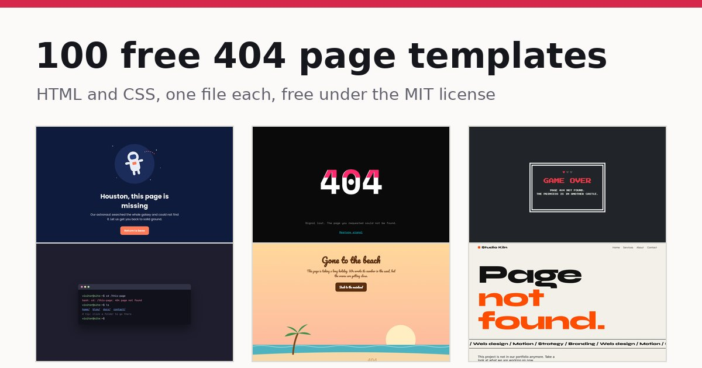

Free 404 error pages in HTML and CSS. Pick one you like, change the name and the links, and upload it to your website. Each template is one file, so there is nothing to install.

**[See all 100 templates with a live demo](https://mmrahmanbappi.github.io/100-free-404-pages/)**

## Why use these templates

- **One file each.** The CSS and JavaScript are inside the HTML file.
- **Works on phones.** Every page fits phones, tablets and big screens.
- **Keeps visitors on your site.** Many have a search box, popular links or a small game.
- **Safe for SEO.** Each page has a noindex tag, and the guide shows how to keep the right 404 status.
- **Free for business use.** MIT license. Use them on your own site or for clients.

## How to download a template

1. Open the [website](https://mmrahmanbappi.github.io/100-free-404-pages/) and find a template you like.
2. Click **Live demo** to see it full size.
3. Click **Download** to save that one template as `404.html`.

Templates are downloaded one at a time, so you only get the page you need.

## How to use it

1. Open `404.html` in any text editor.
2. Change the brand name, the colors and the links.
3. Upload it to your website and tell your server to use it. The [setup guide](https://mmrahmanbappi.github.io/100-free-404-pages/guide/) has copy-paste steps for Apache, cPanel, Nginx, WordPress, Netlify, Vercel, Cloudflare Pages and GitHub Pages.

## Templates

### Minimal (10)

Clean, quiet pages built on strong typography and lots of space. [See all minimal templates](https://mmrahmanbappi.github.io/100-free-404-pages/minimal/)

| Preview | Template |
|---|---|
| [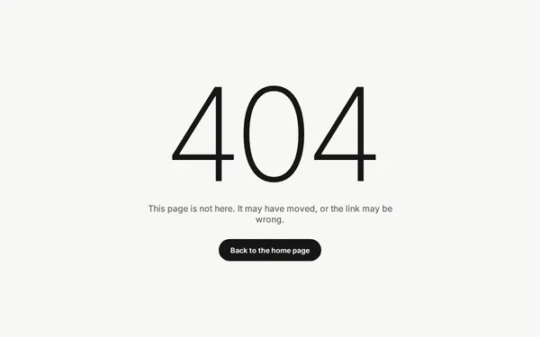](https://mmrahmanbappi.github.io/100-free-404-pages/minimal/big-number/) | **Big Number** A huge 404 in a light weight, with one line of text and one button.  [Live demo](https://mmrahmanbappi.github.io/100-free-404-pages/minimal/big-number/) / [Download from the website](https://mmrahmanbappi.github.io/100-free-404-pages/minimal/) |
| [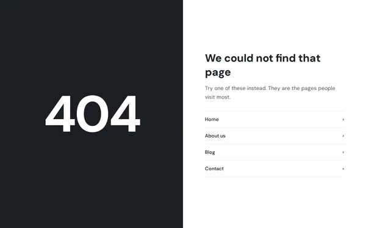](https://mmrahmanbappi.github.io/100-free-404-pages/minimal/split-screen/) | **Split Screen** A two-column layout: the error code on one side, helpful links on the other.  [Live demo](https://mmrahmanbappi.github.io/100-free-404-pages/minimal/split-screen/) / [Download from the website](https://mmrahmanbappi.github.io/100-free-404-pages/minimal/) |
| [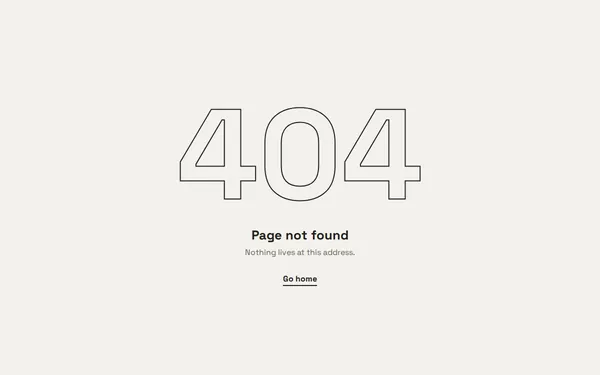](https://mmrahmanbappi.github.io/100-free-404-pages/minimal/outline/) | **Outline** An outlined 404 with a thin stroke and a calm off-white background.  [Live demo](https://mmrahmanbappi.github.io/100-free-404-pages/minimal/outline/) / [Download from the website](https://mmrahmanbappi.github.io/100-free-404-pages/minimal/) |
| [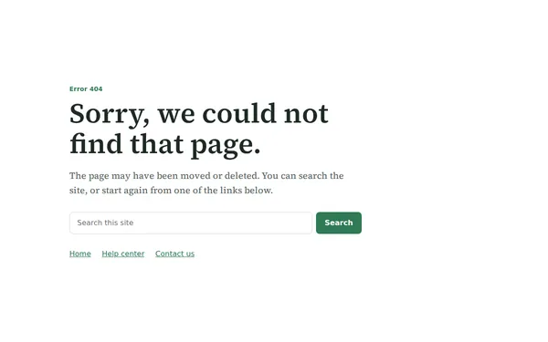](https://mmrahmanbappi.github.io/100-free-404-pages/minimal/left-aligned/) | **Left Aligned** A left-aligned layout that reads like a short letter, with a search box.  [Live demo](https://mmrahmanbappi.github.io/100-free-404-pages/minimal/left-aligned/) / [Download from the website](https://mmrahmanbappi.github.io/100-free-404-pages/minimal/) |
| [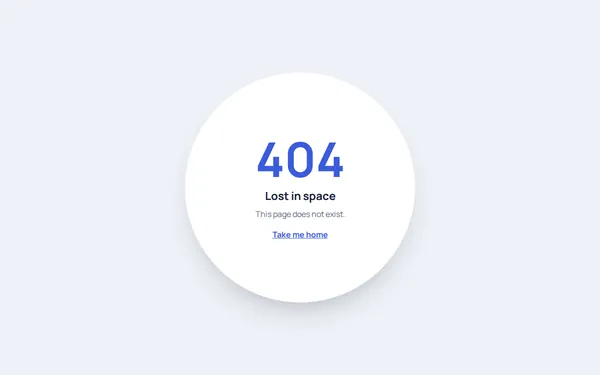](https://mmrahmanbappi.github.io/100-free-404-pages/minimal/circle/) | **Circle** A single large circle frames the message. Simple and memorable.  [Live demo](https://mmrahmanbappi.github.io/100-free-404-pages/minimal/circle/) / [Download from the website](https://mmrahmanbappi.github.io/100-free-404-pages/minimal/) |
| [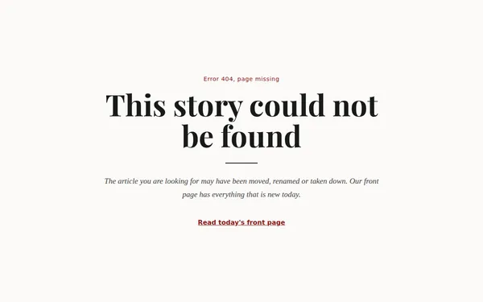](https://mmrahmanbappi.github.io/100-free-404-pages/minimal/serif-editorial/) | **Serif Editorial** A magazine-style page with a large serif headline and a thin rule.  [Live demo](https://mmrahmanbappi.github.io/100-free-404-pages/minimal/serif-editorial/) / [Download from the website](https://mmrahmanbappi.github.io/100-free-404-pages/minimal/) |
| [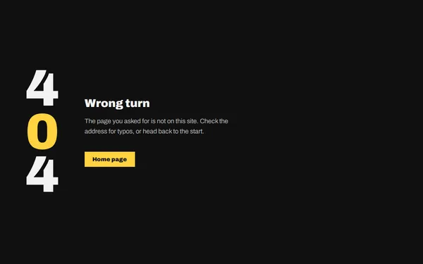](https://mmrahmanbappi.github.io/100-free-404-pages/minimal/stacked-lines/) | **Stacked Lines** The numbers 4, 0 and 4 stacked in three bold rows, with a short note.  [Live demo](https://mmrahmanbappi.github.io/100-free-404-pages/minimal/stacked-lines/) / [Download from the website](https://mmrahmanbappi.github.io/100-free-404-pages/minimal/) |
| [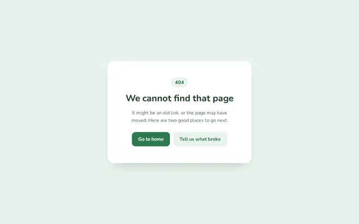](https://mmrahmanbappi.github.io/100-free-404-pages/minimal/card-center/) | **Card** A soft card in the middle of a pale green page, with two buttons.  [Live demo](https://mmrahmanbappi.github.io/100-free-404-pages/minimal/card-center/) / [Download from the website](https://mmrahmanbappi.github.io/100-free-404-pages/minimal/) |
| [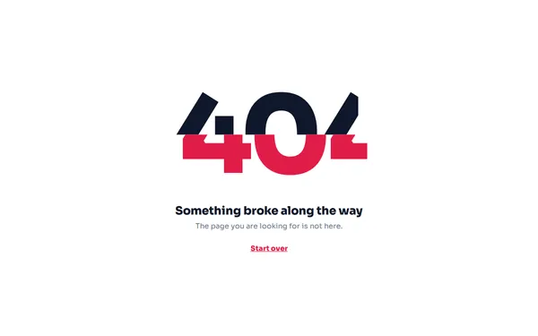](https://mmrahmanbappi.github.io/100-free-404-pages/minimal/half-cut/) | **Half Cut** A 404 sliced in half horizontally, as if the page was torn.  [Live demo](https://mmrahmanbappi.github.io/100-free-404-pages/minimal/half-cut/) / [Download from the website](https://mmrahmanbappi.github.io/100-free-404-pages/minimal/) |
| [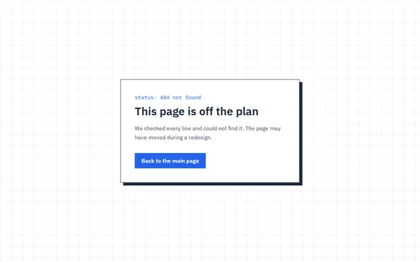](https://mmrahmanbappi.github.io/100-free-404-pages/minimal/grid-lines/) | **Grid Lines** A fine grid background with the message placed like a note on graph paper.  [Live demo](https://mmrahmanbappi.github.io/100-free-404-pages/minimal/grid-lines/) / [Download from the website](https://mmrahmanbappi.github.io/100-free-404-pages/minimal/) |

### Illustrated (10)

Friendly pages with a hand-built SVG illustration at the center. [See all illustrated templates](https://mmrahmanbappi.github.io/100-free-404-pages/illustrated/)

| Preview | Template |
|---|---|
| [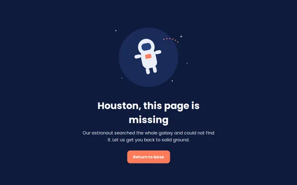](https://mmrahmanbappi.github.io/100-free-404-pages/illustrated/astronaut/) | **Astronaut** An astronaut floating in space, drawn in SVG, on a deep blue background.  [Live demo](https://mmrahmanbappi.github.io/100-free-404-pages/illustrated/astronaut/) / [Download from the website](https://mmrahmanbappi.github.io/100-free-404-pages/illustrated/) |
| [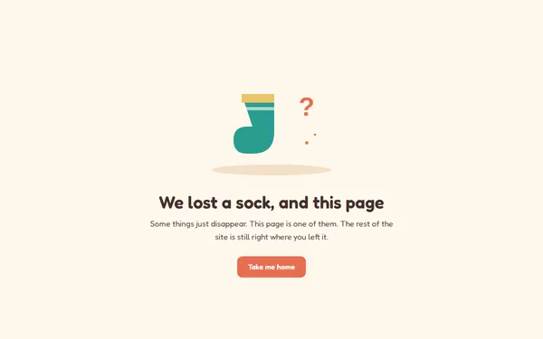](https://mmrahmanbappi.github.io/100-free-404-pages/illustrated/lost-sock/) | **Lost Sock** A single lonely sock and a question mark, in warm cheerful colors.  [Live demo](https://mmrahmanbappi.github.io/100-free-404-pages/illustrated/lost-sock/) / [Download from the website](https://mmrahmanbappi.github.io/100-free-404-pages/illustrated/) |
| [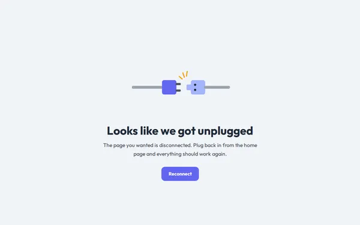](https://mmrahmanbappi.github.io/100-free-404-pages/illustrated/unplugged/) | **Unplugged** A cable and plug pulled apart, with little sparks. Great for tech and service sites.  [Live demo](https://mmrahmanbappi.github.io/100-free-404-pages/illustrated/unplugged/) / [Download from the website](https://mmrahmanbappi.github.io/100-free-404-pages/illustrated/) |
| [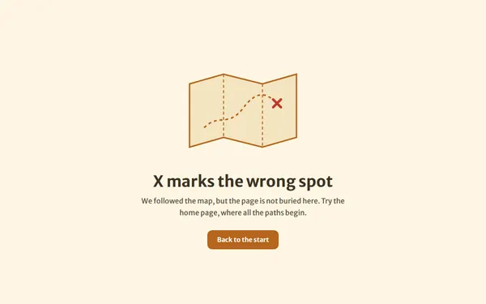](https://mmrahmanbappi.github.io/100-free-404-pages/illustrated/treasure-map/) | **Treasure Map** An old treasure map with a dotted path that ends at a red X.  [Live demo](https://mmrahmanbappi.github.io/100-free-404-pages/illustrated/treasure-map/) / [Download from the website](https://mmrahmanbappi.github.io/100-free-404-pages/illustrated/) |
| [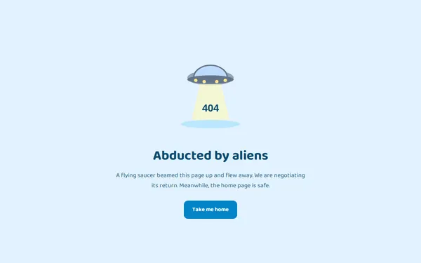](https://mmrahmanbappi.github.io/100-free-404-pages/illustrated/ufo/) | **UFO** A flying saucer beaming up the number 404, on a soft sky blue.  [Live demo](https://mmrahmanbappi.github.io/100-free-404-pages/illustrated/ufo/) / [Download from the website](https://mmrahmanbappi.github.io/100-free-404-pages/illustrated/) |
| [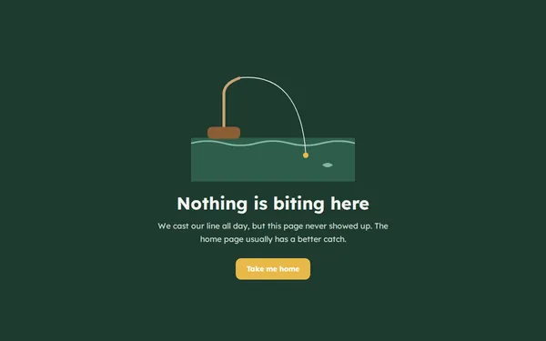](https://mmrahmanbappi.github.io/100-free-404-pages/illustrated/fishing/) | **Fishing** Someone fishing on a quiet lake, with no page on the hook.  [Live demo](https://mmrahmanbappi.github.io/100-free-404-pages/illustrated/fishing/) / [Download from the website](https://mmrahmanbappi.github.io/100-free-404-pages/illustrated/) |
| [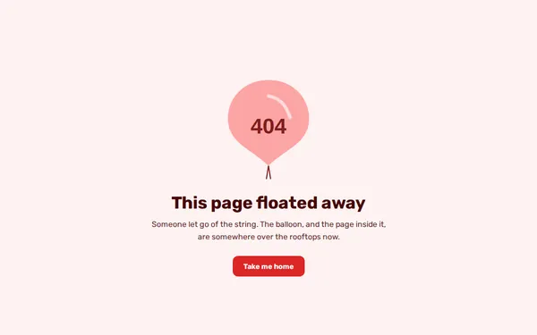](https://mmrahmanbappi.github.io/100-free-404-pages/illustrated/balloon/) | **Balloon** A red balloon with 404 written on it, drifting upward.  [Live demo](https://mmrahmanbappi.github.io/100-free-404-pages/illustrated/balloon/) / [Download from the website](https://mmrahmanbappi.github.io/100-free-404-pages/illustrated/) |
| [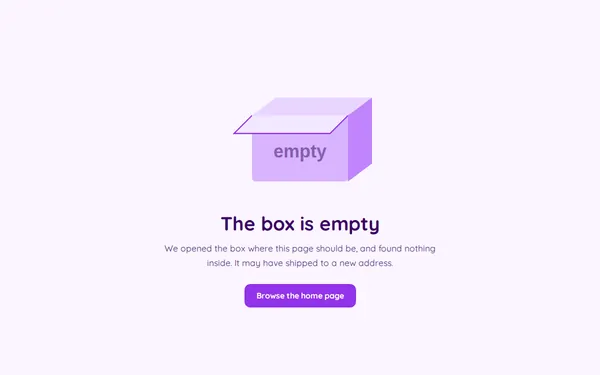](https://mmrahmanbappi.github.io/100-free-404-pages/illustrated/empty-box/) | **Empty Box** An open cardboard box with nothing inside, in soft lavender.  [Live demo](https://mmrahmanbappi.github.io/100-free-404-pages/illustrated/empty-box/) / [Download from the website](https://mmrahmanbappi.github.io/100-free-404-pages/illustrated/) |
| [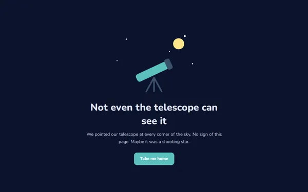](https://mmrahmanbappi.github.io/100-free-404-pages/illustrated/telescope/) | **Telescope** A telescope pointed at a starry night sky and a pale yellow moon.  [Live demo](https://mmrahmanbappi.github.io/100-free-404-pages/illustrated/telescope/) / [Download from the website](https://mmrahmanbappi.github.io/100-free-404-pages/illustrated/) |
| [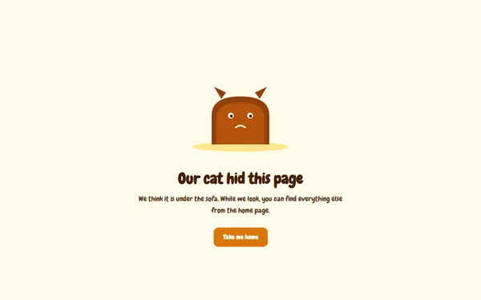](https://mmrahmanbappi.github.io/100-free-404-pages/illustrated/hiding-cat/) | **Hiding Cat** A sulky cartoon cat that clearly hid the page somewhere.  [Live demo](https://mmrahmanbappi.github.io/100-free-404-pages/illustrated/hiding-cat/) / [Download from the website](https://mmrahmanbappi.github.io/100-free-404-pages/illustrated/) |

### Animated (10)

Pages with gentle CSS animation that brings the error to life. [See all animated templates](https://mmrahmanbappi.github.io/100-free-404-pages/animated/)

| Preview | Template |
|---|---|
| [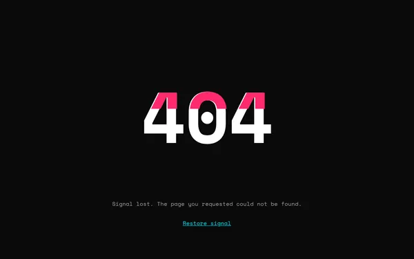](https://mmrahmanbappi.github.io/100-free-404-pages/animated/glitch/) | **Glitch** A glitching 404 with red and cyan color shifts on a black screen.  [Live demo](https://mmrahmanbappi.github.io/100-free-404-pages/animated/glitch/) / [Download from the website](https://mmrahmanbappi.github.io/100-free-404-pages/animated/) |
| [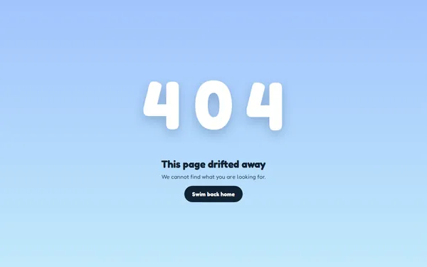](https://mmrahmanbappi.github.io/100-free-404-pages/animated/floating-numbers/) | **Floating Numbers** Each digit of 404 floats up and down on its own, like it is underwater.  [Live demo](https://mmrahmanbappi.github.io/100-free-404-pages/animated/floating-numbers/) / [Download from the website](https://mmrahmanbappi.github.io/100-free-404-pages/animated/) |
| [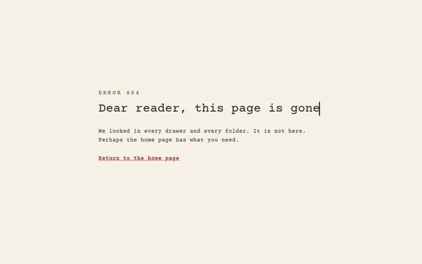](https://mmrahmanbappi.github.io/100-free-404-pages/animated/typewriter/) | **Typewriter** The message types itself out letter by letter, with a blinking cursor.  [Live demo](https://mmrahmanbappi.github.io/100-free-404-pages/animated/typewriter/) / [Download from the website](https://mmrahmanbappi.github.io/100-free-404-pages/animated/) |
| [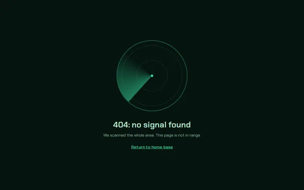](https://mmrahmanbappi.github.io/100-free-404-pages/animated/pulse-radar/) | **Radar** A radar sweeps the screen looking for the page, and finds nothing.  [Live demo](https://mmrahmanbappi.github.io/100-free-404-pages/animated/pulse-radar/) / [Download from the website](https://mmrahmanbappi.github.io/100-free-404-pages/animated/) |
| [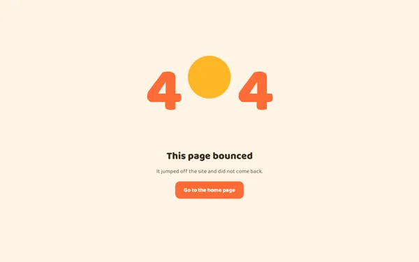](https://mmrahmanbappi.github.io/100-free-404-pages/animated/bouncing-ball/) | **Bouncing Ball** The zero in 404 is a ball that keeps bouncing between the fours.  [Live demo](https://mmrahmanbappi.github.io/100-free-404-pages/animated/bouncing-ball/) / [Download from the website](https://mmrahmanbappi.github.io/100-free-404-pages/animated/) |
| [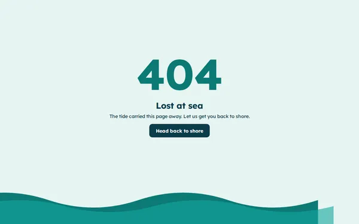](https://mmrahmanbappi.github.io/100-free-404-pages/animated/waves/) | **Waves** Animated ocean waves roll along the bottom of the page.  [Live demo](https://mmrahmanbappi.github.io/100-free-404-pages/animated/waves/) / [Download from the website](https://mmrahmanbappi.github.io/100-free-404-pages/animated/) |
| [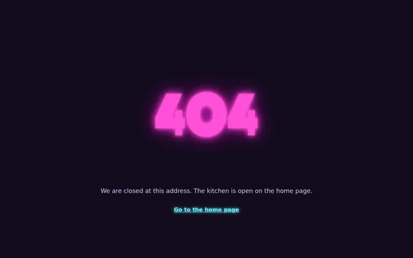](https://mmrahmanbappi.github.io/100-free-404-pages/animated/flicker-sign/) | **Flicker Sign** A neon sign that flickers on and off, like a diner at midnight.  [Live demo](https://mmrahmanbappi.github.io/100-free-404-pages/animated/flicker-sign/) / [Download from the website](https://mmrahmanbappi.github.io/100-free-404-pages/animated/) |
| [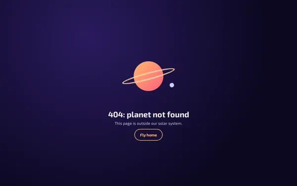](https://mmrahmanbappi.github.io/100-free-404-pages/animated/rotating-planet/) | **Planet** A ringed planet slowly turns while a small moon circles around it.  [Live demo](https://mmrahmanbappi.github.io/100-free-404-pages/animated/rotating-planet/) / [Download from the website](https://mmrahmanbappi.github.io/100-free-404-pages/animated/) |
| [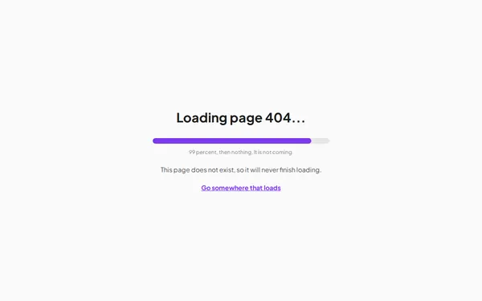](https://mmrahmanbappi.github.io/100-free-404-pages/animated/loading-bar/) | **Endless Loading** A loading bar that fills up and then gives up, over and over.  [Live demo](https://mmrahmanbappi.github.io/100-free-404-pages/animated/loading-bar/) / [Download from the website](https://mmrahmanbappi.github.io/100-free-404-pages/animated/) |
| [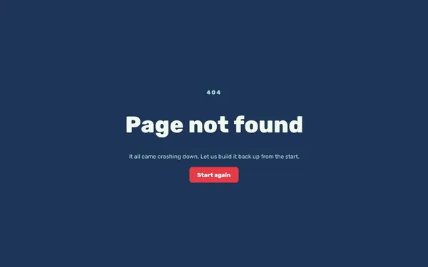](https://mmrahmanbappi.github.io/100-free-404-pages/animated/falling-letters/) | **Falling Letters** The words 'page not found' fall down one letter at a time and land in a pile.  [Live demo](https://mmrahmanbappi.github.io/100-free-404-pages/animated/falling-letters/) / [Download from the website](https://mmrahmanbappi.github.io/100-free-404-pages/animated/) |

### Interactive (10)

Pages with a small game or toy, so visitors smile before they leave. [See all interactive templates](https://mmrahmanbappi.github.io/100-free-404-pages/interactive/)

| Preview | Template |
|---|---|
| [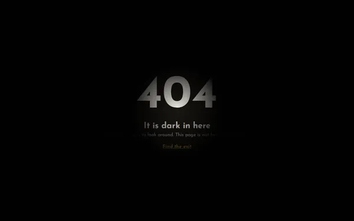](https://mmrahmanbappi.github.io/100-free-404-pages/interactive/flashlight/) | **Flashlight** The page is dark. Move your mouse or finger to shine a light and find the way home.  [Live demo](https://mmrahmanbappi.github.io/100-free-404-pages/interactive/flashlight/) / [Download from the website](https://mmrahmanbappi.github.io/100-free-404-pages/interactive/) |
| [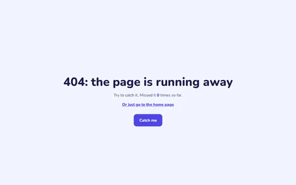](https://mmrahmanbappi.github.io/100-free-404-pages/interactive/catch-the-page/) | **Catch the Page** A button that runs away from the cursor. Visitors try to catch the missing page.  [Live demo](https://mmrahmanbappi.github.io/100-free-404-pages/interactive/catch-the-page/) / [Download from the website](https://mmrahmanbappi.github.io/100-free-404-pages/interactive/) |
| [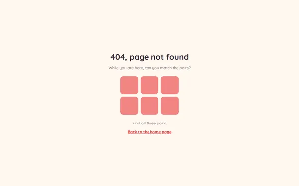](https://mmrahmanbappi.github.io/100-free-404-pages/interactive/memory-cards/) | **Memory Cards** A tiny memory game with six cards while visitors decide where to go next.  [Live demo](https://mmrahmanbappi.github.io/100-free-404-pages/interactive/memory-cards/) / [Download from the website](https://mmrahmanbappi.github.io/100-free-404-pages/interactive/) |
| [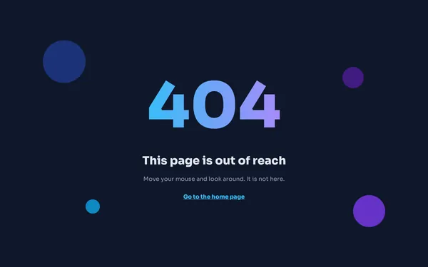](https://mmrahmanbappi.github.io/100-free-404-pages/interactive/parallax-mouse/) | **Parallax** Layers of shapes move at different speeds as you move the mouse, giving a sense of depth.  [Live demo](https://mmrahmanbappi.github.io/100-free-404-pages/interactive/parallax-mouse/) / [Download from the website](https://mmrahmanbappi.github.io/100-free-404-pages/interactive/) |
| [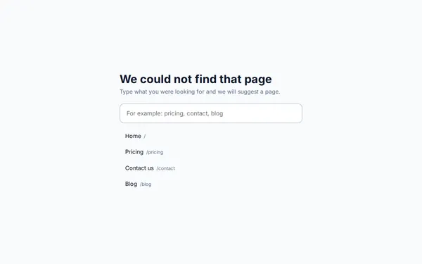](https://mmrahmanbappi.github.io/100-free-404-pages/interactive/search-helper/) | **Search Helper** Suggests real pages as visitors type, using a small list you can edit in the file.  [Live demo](https://mmrahmanbappi.github.io/100-free-404-pages/interactive/search-helper/) / [Download from the website](https://mmrahmanbappi.github.io/100-free-404-pages/interactive/) |
| [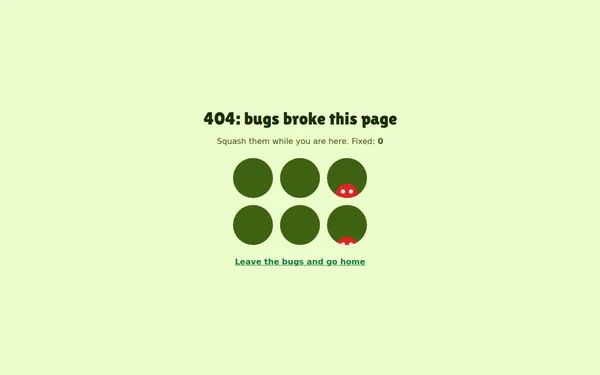](https://mmrahmanbappi.github.io/100-free-404-pages/interactive/whack-a-bug/) | **Whack a Bug** Little bugs pop up out of holes. Click them to fix the broken page.  [Live demo](https://mmrahmanbappi.github.io/100-free-404-pages/interactive/whack-a-bug/) / [Download from the website](https://mmrahmanbappi.github.io/100-free-404-pages/interactive/) |
| [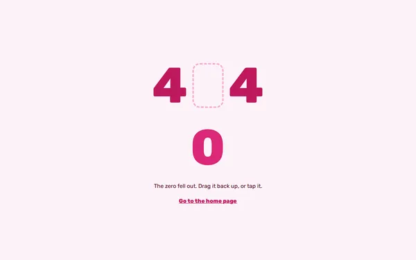](https://mmrahmanbappi.github.io/100-free-404-pages/interactive/drag-the-zero/) | **Fix the Number** The 0 fell out of 404. Drag it back into place, or tap it, to fix the page.  [Live demo](https://mmrahmanbappi.github.io/100-free-404-pages/interactive/drag-the-zero/) / [Download from the website](https://mmrahmanbappi.github.io/100-free-404-pages/interactive/) |
| [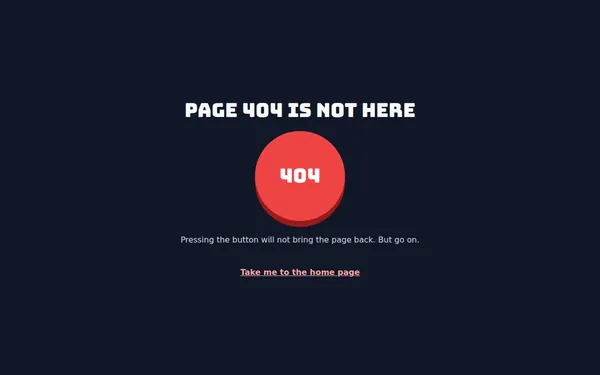](https://mmrahmanbappi.github.io/100-free-404-pages/interactive/click-counter/) | **Button Masher** A big button that counts clicks and says something new at each milestone.  [Live demo](https://mmrahmanbappi.github.io/100-free-404-pages/interactive/click-counter/) / [Download from the website](https://mmrahmanbappi.github.io/100-free-404-pages/interactive/) |
| [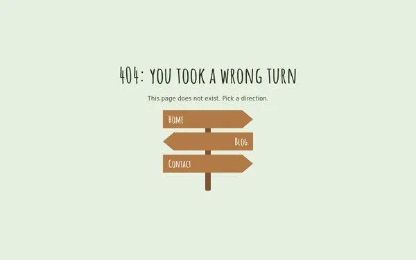](https://mmrahmanbappi.github.io/100-free-404-pages/interactive/choose-path/) | **Choose a Path** A signpost with three arrows pointing to real pages on the site.  [Live demo](https://mmrahmanbappi.github.io/100-free-404-pages/interactive/choose-path/) / [Download from the website](https://mmrahmanbappi.github.io/100-free-404-pages/interactive/) |
| [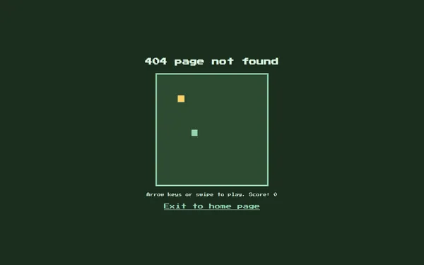](https://mmrahmanbappi.github.io/100-free-404-pages/interactive/tiny-snake/) | **Snake** A playable mini snake game. Use arrow keys or swipe to play.  [Live demo](https://mmrahmanbappi.github.io/100-free-404-pages/interactive/tiny-snake/) / [Download from the website](https://mmrahmanbappi.github.io/100-free-404-pages/interactive/) |

### Dark and Neon (10)

Dark backgrounds, glowing colors and night-time moods. [See all dark and neon templates](https://mmrahmanbappi.github.io/100-free-404-pages/dark/)

| Preview | Template |
|---|---|
| [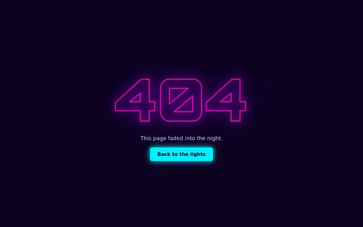](https://mmrahmanbappi.github.io/100-free-404-pages/dark/neon-outline/) | **Neon Outline** A glowing outlined 404 in pink and blue on a very dark purple.  [Live demo](https://mmrahmanbappi.github.io/100-free-404-pages/dark/neon-outline/) / [Download from the website](https://mmrahmanbappi.github.io/100-free-404-pages/dark/) |
| [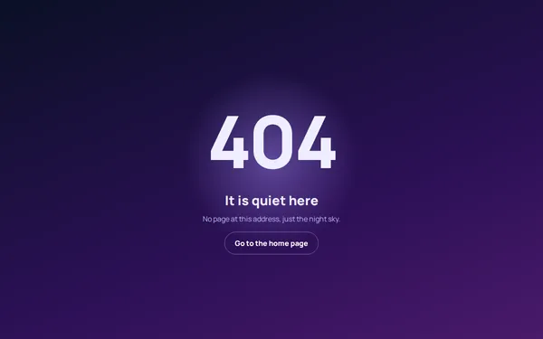](https://mmrahmanbappi.github.io/100-free-404-pages/dark/midnight-gradient/) | **Midnight Gradient** A deep blue to violet gradient with a soft glowing orb behind the text.  [Live demo](https://mmrahmanbappi.github.io/100-free-404-pages/dark/midnight-gradient/) / [Download from the website](https://mmrahmanbappi.github.io/100-free-404-pages/dark/) |
| [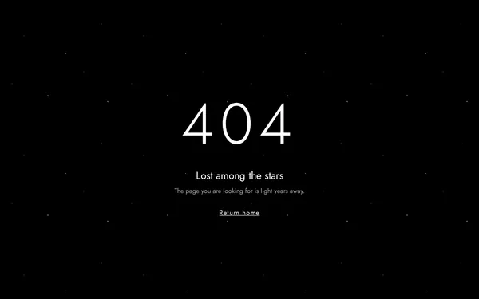](https://mmrahmanbappi.github.io/100-free-404-pages/dark/starfield/) | **Starfield** A field of twinkling stars made with CSS, with a clean white message.  [Live demo](https://mmrahmanbappi.github.io/100-free-404-pages/dark/starfield/) / [Download from the website](https://mmrahmanbappi.github.io/100-free-404-pages/dark/) |
| [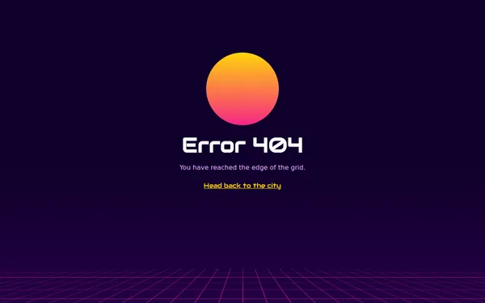](https://mmrahmanbappi.github.io/100-free-404-pages/dark/cyber-grid/) | **Cyber Grid** A perspective grid floor that fades into the horizon, in eighties sci-fi style.  [Live demo](https://mmrahmanbappi.github.io/100-free-404-pages/dark/cyber-grid/) / [Download from the website](https://mmrahmanbappi.github.io/100-free-404-pages/dark/) |
| [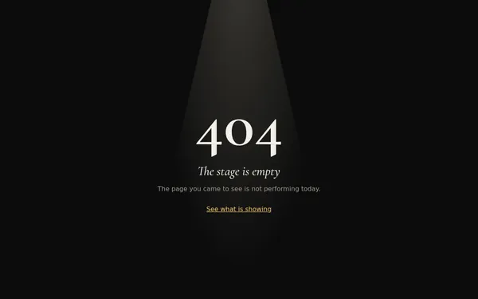](https://mmrahmanbappi.github.io/100-free-404-pages/dark/spotlight-dark/) | **Spotlight** A single stage spotlight lights up the 404 on an empty dark stage.  [Live demo](https://mmrahmanbappi.github.io/100-free-404-pages/dark/spotlight-dark/) / [Download from the website](https://mmrahmanbappi.github.io/100-free-404-pages/dark/) |
| [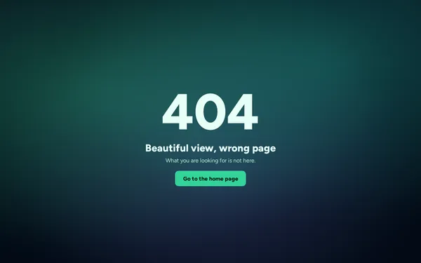](https://mmrahmanbappi.github.io/100-free-404-pages/dark/aurora/) | **Aurora** Soft moving northern lights in green and teal behind the message.  [Live demo](https://mmrahmanbappi.github.io/100-free-404-pages/dark/aurora/) / [Download from the website](https://mmrahmanbappi.github.io/100-free-404-pages/dark/) |
| [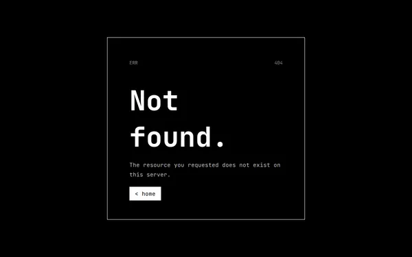](https://mmrahmanbappi.github.io/100-free-404-pages/dark/dark-minimal-mono/) | **Dark Mono** A strict black and white layout with a monospaced font and a thin frame.  [Live demo](https://mmrahmanbappi.github.io/100-free-404-pages/dark/dark-minimal-mono/) / [Download from the website](https://mmrahmanbappi.github.io/100-free-404-pages/dark/) |
| [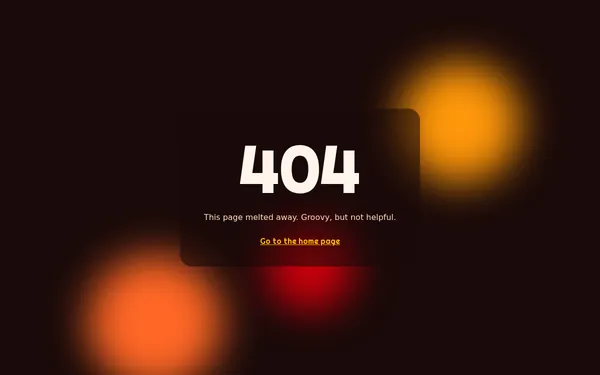](https://mmrahmanbappi.github.io/100-free-404-pages/dark/lava-lamp/) | **Lava Lamp** Warm blobs slowly rise and melt together behind a dark glass panel.  [Live demo](https://mmrahmanbappi.github.io/100-free-404-pages/dark/lava-lamp/) / [Download from the website](https://mmrahmanbappi.github.io/100-free-404-pages/dark/) |
| [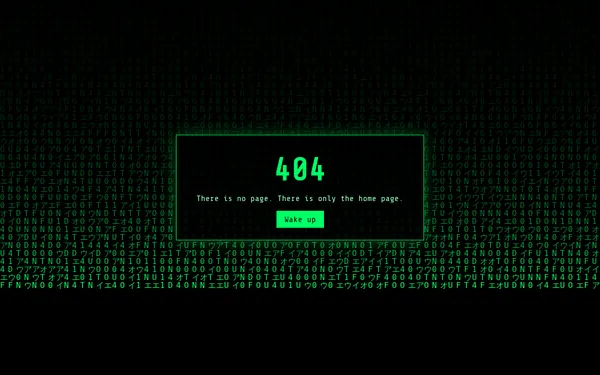](https://mmrahmanbappi.github.io/100-free-404-pages/dark/matrix-rain/) | **Code Rain** Green characters rain down the screen behind a black message box.  [Live demo](https://mmrahmanbappi.github.io/100-free-404-pages/dark/matrix-rain/) / [Download from the website](https://mmrahmanbappi.github.io/100-free-404-pages/dark/) |
| [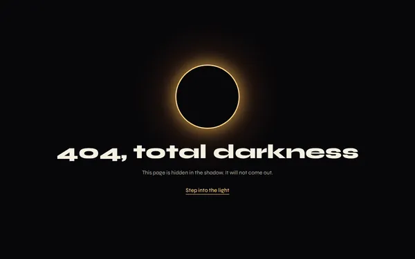](https://mmrahmanbappi.github.io/100-free-404-pages/dark/eclipse/) | **Eclipse** A solar eclipse, a black disc with a glowing golden ring, above the message.  [Live demo](https://mmrahmanbappi.github.io/100-free-404-pages/dark/eclipse/) / [Download from the website](https://mmrahmanbappi.github.io/100-free-404-pages/dark/) |

### Retro (10)

Pages inspired by old computers, arcades, print and tape. [See all retro templates](https://mmrahmanbappi.github.io/100-free-404-pages/retro/)

| Preview | Template |
|---|---|
| [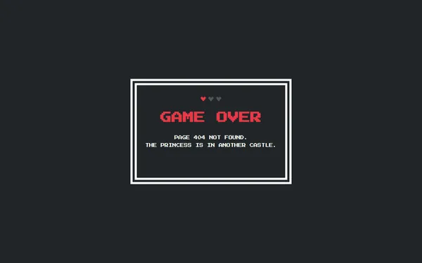](https://mmrahmanbappi.github.io/100-free-404-pages/retro/eight-bit/) | **8-bit** A pixel-art game screen: 'Game over, page not found', press start to continue.  [Live demo](https://mmrahmanbappi.github.io/100-free-404-pages/retro/eight-bit/) / [Download from the website](https://mmrahmanbappi.github.io/100-free-404-pages/retro/) |
| [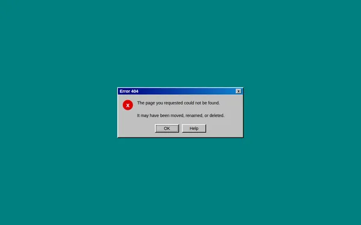](https://mmrahmanbappi.github.io/100-free-404-pages/retro/windows-dialog/) | **Classic Dialog** An old desktop error window with a grey title bar and an OK button.  [Live demo](https://mmrahmanbappi.github.io/100-free-404-pages/retro/windows-dialog/) / [Download from the website](https://mmrahmanbappi.github.io/100-free-404-pages/retro/) |
| [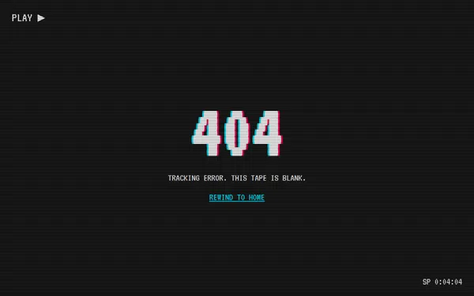](https://mmrahmanbappi.github.io/100-free-404-pages/retro/vhs-tape/) | **VHS Tape** A VHS screen with 'PLAY' in the corner, scan lines and a tracking wobble.  [Live demo](https://mmrahmanbappi.github.io/100-free-404-pages/retro/vhs-tape/) / [Download from the website](https://mmrahmanbappi.github.io/100-free-404-pages/retro/) |
| [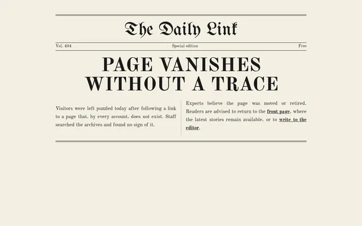](https://mmrahmanbappi.github.io/100-free-404-pages/retro/newspaper/) | **Newspaper** A front page with a big headline announcing the missing page.  [Live demo](https://mmrahmanbappi.github.io/100-free-404-pages/retro/newspaper/) / [Download from the website](https://mmrahmanbappi.github.io/100-free-404-pages/retro/) |
| [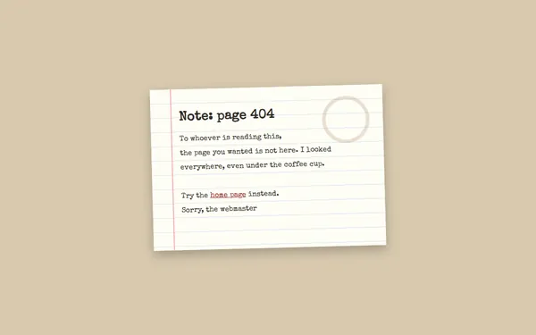](https://mmrahmanbappi.github.io/100-free-404-pages/retro/typewriter-paper/) | **Paper Note** A typed note on lined paper with a coffee ring stain.  [Live demo](https://mmrahmanbappi.github.io/100-free-404-pages/retro/typewriter-paper/) / [Download from the website](https://mmrahmanbappi.github.io/100-free-404-pages/retro/) |
| [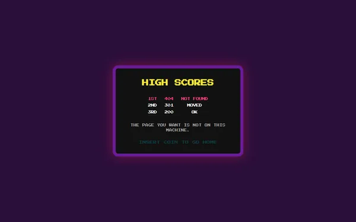](https://mmrahmanbappi.github.io/100-free-404-pages/retro/arcade-cabinet/) | **Arcade** An arcade screen with 'Insert coin' and a high score table where 404 is the top score.  [Live demo](https://mmrahmanbappi.github.io/100-free-404-pages/retro/arcade-cabinet/) / [Download from the website](https://mmrahmanbappi.github.io/100-free-404-pages/retro/) |
| [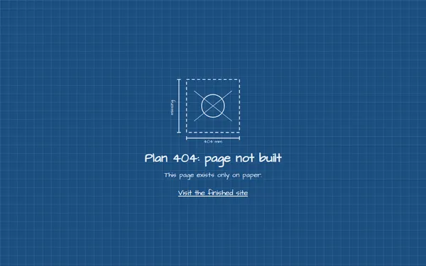](https://mmrahmanbappi.github.io/100-free-404-pages/retro/blueprint/) | **Blueprint** A technical drawing of a missing page, with measurements and notes.  [Live demo](https://mmrahmanbappi.github.io/100-free-404-pages/retro/blueprint/) / [Download from the website](https://mmrahmanbappi.github.io/100-free-404-pages/retro/) |
| [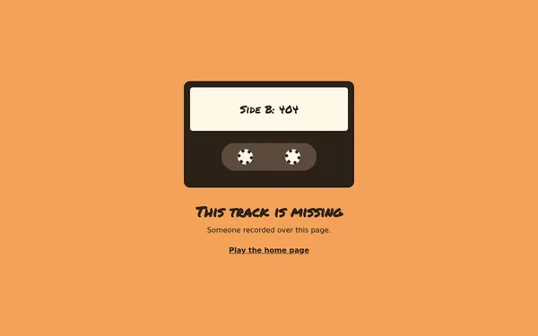](https://mmrahmanbappi.github.io/100-free-404-pages/retro/cassette/) | **Cassette** A cassette tape with a hand-written label, on a warm orange background.  [Live demo](https://mmrahmanbappi.github.io/100-free-404-pages/retro/cassette/) / [Download from the website](https://mmrahmanbappi.github.io/100-free-404-pages/retro/) |
| [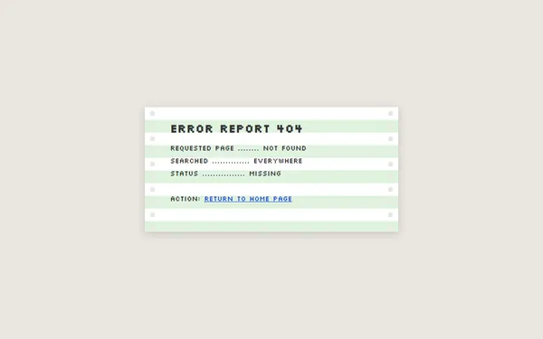](https://mmrahmanbappi.github.io/100-free-404-pages/retro/dot-matrix/) | **Dot Matrix** A dot matrix printout with tractor feed holes and a green stripe.  [Live demo](https://mmrahmanbappi.github.io/100-free-404-pages/retro/dot-matrix/) / [Download from the website](https://mmrahmanbappi.github.io/100-free-404-pages/retro/) |
| [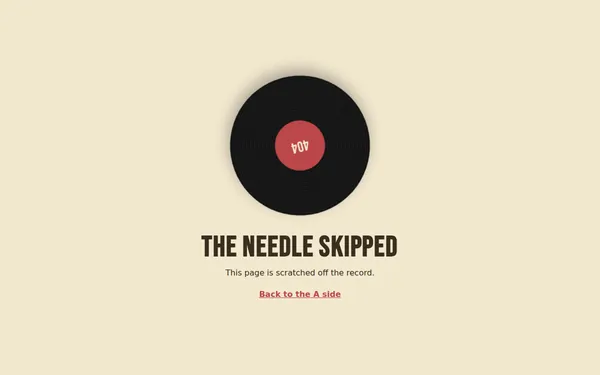](https://mmrahmanbappi.github.io/100-free-404-pages/retro/vinyl-record/) | **Vinyl** A spinning vinyl record with a 404 label, like the needle skipped.  [Live demo](https://mmrahmanbappi.github.io/100-free-404-pages/retro/vinyl-record/) / [Download from the website](https://mmrahmanbappi.github.io/100-free-404-pages/retro/) |

### Developer (10)

Terminals, code editors and error logs for tech and developer sites. [See all developer templates](https://mmrahmanbappi.github.io/100-free-404-pages/developer/)

| Preview | Template |
|---|---|
| [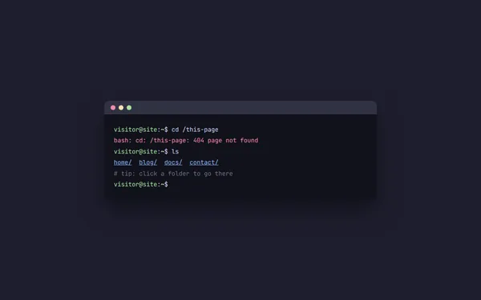](https://mmrahmanbappi.github.io/100-free-404-pages/developer/terminal/) | **Terminal** A terminal window that runs a command, prints 'not found' and suggests going home.  [Live demo](https://mmrahmanbappi.github.io/100-free-404-pages/developer/terminal/) / [Download from the website](https://mmrahmanbappi.github.io/100-free-404-pages/developer/) |
| [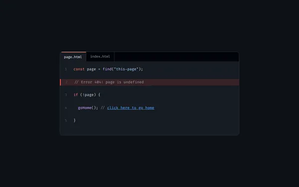](https://mmrahmanbappi.github.io/100-free-404-pages/developer/code-editor/) | **Code Editor** A code editor with line numbers, where the page file is highlighted as missing.  [Live demo](https://mmrahmanbappi.github.io/100-free-404-pages/developer/code-editor/) / [Download from the website](https://mmrahmanbappi.github.io/100-free-404-pages/developer/) |
| [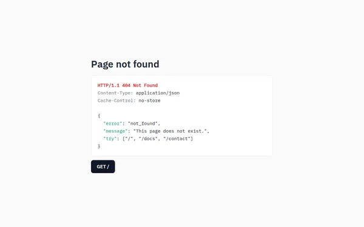](https://mmrahmanbappi.github.io/100-free-404-pages/developer/http-response/) | **HTTP Response** The raw HTTP response for a 404, with headers and a short JSON body.  [Live demo](https://mmrahmanbappi.github.io/100-free-404-pages/developer/http-response/) / [Download from the website](https://mmrahmanbappi.github.io/100-free-404-pages/developer/) |
| [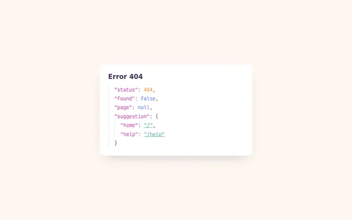](https://mmrahmanbappi.github.io/100-free-404-pages/developer/json-viewer/) | **JSON Viewer** A friendly JSON tree view of the error, in soft pastel colors.  [Live demo](https://mmrahmanbappi.github.io/100-free-404-pages/developer/json-viewer/) / [Download from the website](https://mmrahmanbappi.github.io/100-free-404-pages/developer/) |
| [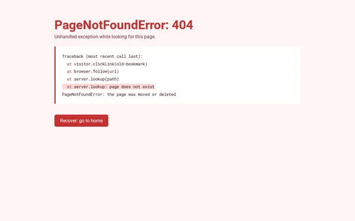](https://mmrahmanbappi.github.io/100-free-404-pages/developer/stack-trace/) | **Stack Trace** A funny stack trace that explains exactly how the visitor got lost.  [Live demo](https://mmrahmanbappi.github.io/100-free-404-pages/developer/stack-trace/) / [Download from the website](https://mmrahmanbappi.github.io/100-free-404-pages/developer/) |
| [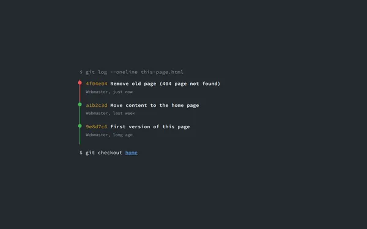](https://mmrahmanbappi.github.io/100-free-404-pages/developer/git-log/) | **Git Log** A git log that shows the commit where the page was deleted.  [Live demo](https://mmrahmanbappi.github.io/100-free-404-pages/developer/git-log/) / [Download from the website](https://mmrahmanbappi.github.io/100-free-404-pages/developer/) |
| [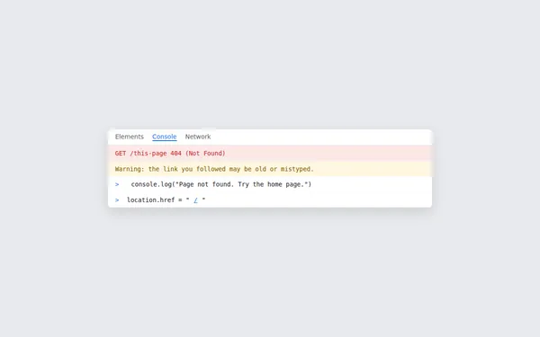](https://mmrahmanbappi.github.io/100-free-404-pages/developer/browser-console/) | **Console** A browser console panel with a red error line and a helpful log message.  [Live demo](https://mmrahmanbappi.github.io/100-free-404-pages/developer/browser-console/) / [Download from the website](https://mmrahmanbappi.github.io/100-free-404-pages/developer/) |
| [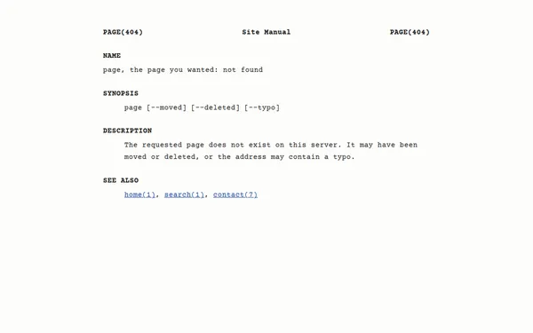](https://mmrahmanbappi.github.io/100-free-404-pages/developer/man-page/) | **Man Page** A Unix manual page for the missing page, with name, synopsis and 'see also'.  [Live demo](https://mmrahmanbappi.github.io/100-free-404-pages/developer/man-page/) / [Download from the website](https://mmrahmanbappi.github.io/100-free-404-pages/developer/) |
| [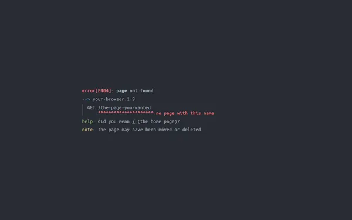](https://mmrahmanbappi.github.io/100-free-404-pages/developer/compiler-error/) | **Compiler Error** A build that failed with a friendly compiler message pointing to the typo.  [Live demo](https://mmrahmanbappi.github.io/100-free-404-pages/developer/compiler-error/) / [Download from the website](https://mmrahmanbappi.github.io/100-free-404-pages/developer/) |
| [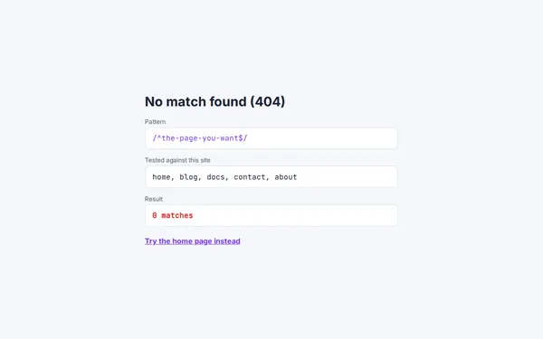](https://mmrahmanbappi.github.io/100-free-404-pages/developer/regex-test/) | **Regex Tester** A regex tester where the pattern for the page matches nothing at all.  [Live demo](https://mmrahmanbappi.github.io/100-free-404-pages/developer/regex-test/) / [Download from the website](https://mmrahmanbappi.github.io/100-free-404-pages/developer/) |

### Business (10)

Helpful, on-brand pages for companies, shops, schools and clinics. [See all business templates](https://mmrahmanbappi.github.io/100-free-404-pages/business/)

| Preview | Template |
|---|---|
| [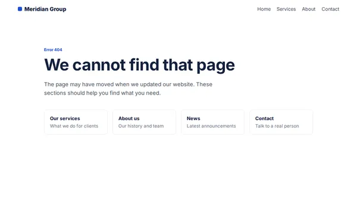](https://mmrahmanbappi.github.io/100-free-404-pages/business/corporate/) | **Corporate** A calm page for a company. It keeps your menu and shows four useful links.  [Live demo](https://mmrahmanbappi.github.io/100-free-404-pages/business/corporate/) / [Download from the website](https://mmrahmanbappi.github.io/100-free-404-pages/business/) |
| [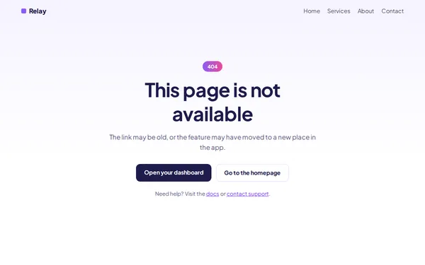](https://mmrahmanbappi.github.io/100-free-404-pages/business/saas/) | **SaaS** A page for a software product. It has a button to the dashboard and help links.  [Live demo](https://mmrahmanbappi.github.io/100-free-404-pages/business/saas/) / [Download from the website](https://mmrahmanbappi.github.io/100-free-404-pages/business/) |
| [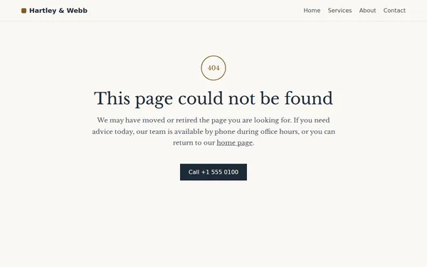](https://mmrahmanbappi.github.io/100-free-404-pages/business/law-firm/) | **Law Firm** A formal page for a law or accounting firm, with a big phone button.  [Live demo](https://mmrahmanbappi.github.io/100-free-404-pages/business/law-firm/) / [Download from the website](https://mmrahmanbappi.github.io/100-free-404-pages/business/) |
| [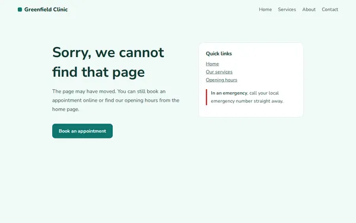](https://mmrahmanbappi.github.io/100-free-404-pages/business/clinic/) | **Clinic** A calm page for a clinic, with a booking button and a note for emergencies.  [Live demo](https://mmrahmanbappi.github.io/100-free-404-pages/business/clinic/) / [Download from the website](https://mmrahmanbappi.github.io/100-free-404-pages/business/) |
| [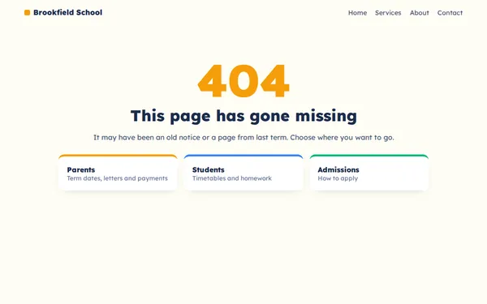](https://mmrahmanbappi.github.io/100-free-404-pages/business/school/) | **School** A bright page for a school, with links for parents, students and new families.  [Live demo](https://mmrahmanbappi.github.io/100-free-404-pages/business/school/) / [Download from the website](https://mmrahmanbappi.github.io/100-free-404-pages/business/) |
| [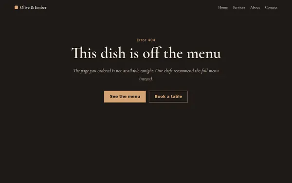](https://mmrahmanbappi.github.io/100-free-404-pages/business/restaurant/) | **Restaurant** A warm page for a restaurant. The dish is off the menu, but the table is not.  [Live demo](https://mmrahmanbappi.github.io/100-free-404-pages/business/restaurant/) / [Download from the website](https://mmrahmanbappi.github.io/100-free-404-pages/business/) |
| [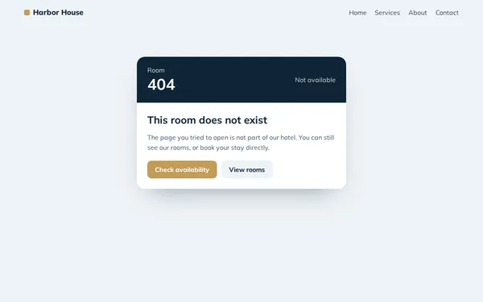](https://mmrahmanbappi.github.io/100-free-404-pages/business/hotel/) | **Hotel** A hotel page shaped like a room key card, with links to rooms and bookings.  [Live demo](https://mmrahmanbappi.github.io/100-free-404-pages/business/hotel/) / [Download from the website](https://mmrahmanbappi.github.io/100-free-404-pages/business/) |
| [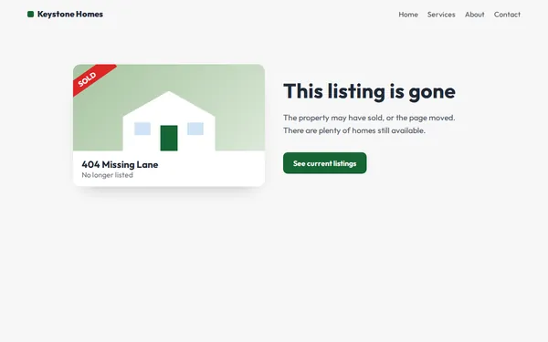](https://mmrahmanbappi.github.io/100-free-404-pages/business/real-estate/) | **Real Estate** A house listing marked sold, with a link to homes that are still for sale.  [Live demo](https://mmrahmanbappi.github.io/100-free-404-pages/business/real-estate/) / [Download from the website](https://mmrahmanbappi.github.io/100-free-404-pages/business/) |
| [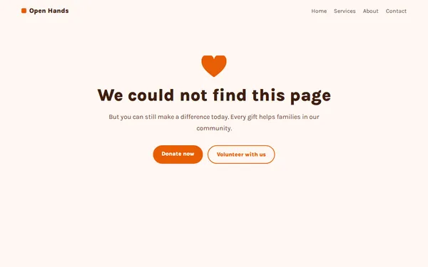](https://mmrahmanbappi.github.io/100-free-404-pages/business/nonprofit/) | **Nonprofit** A friendly page for a charity, with a donate button and a volunteer link.  [Live demo](https://mmrahmanbappi.github.io/100-free-404-pages/business/nonprofit/) / [Download from the website](https://mmrahmanbappi.github.io/100-free-404-pages/business/) |
|  | **Creative Agency** A bold page for a design agency, with giant type and a moving list of services.  [Live demo](https://mmrahmanbappi.github.io/100-free-404-pages/business/agency/) / [Download from the website](https://mmrahmanbappi.github.io/100-free-404-pages/business/) |

### E-commerce (10)

Pages that turn a missing product into a way back to shopping. [See all e-commerce templates](https://mmrahmanbappi.github.io/100-free-404-pages/ecommerce/)

| Preview | Template |
|---|---|
| [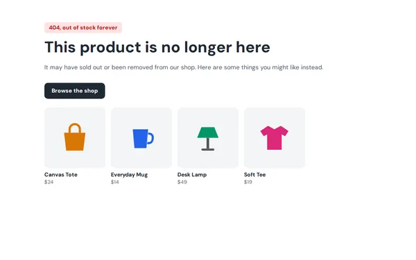](https://mmrahmanbappi.github.io/100-free-404-pages/ecommerce/out-of-stock/) | **Out of Stock** A product page that says 'out of stock' and shows four similar products.  [Live demo](https://mmrahmanbappi.github.io/100-free-404-pages/ecommerce/out-of-stock/) / [Download from the website](https://mmrahmanbappi.github.io/100-free-404-pages/ecommerce/) |
| [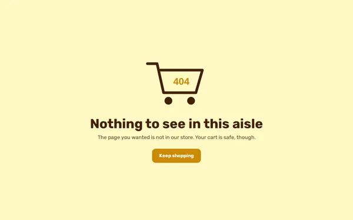](https://mmrahmanbappi.github.io/100-free-404-pages/ecommerce/empty-cart/) | **Empty Cart** A shopping cart icon with nothing inside and a button to keep shopping.  [Live demo](https://mmrahmanbappi.github.io/100-free-404-pages/ecommerce/empty-cart/) / [Download from the website](https://mmrahmanbappi.github.io/100-free-404-pages/ecommerce/) |
| [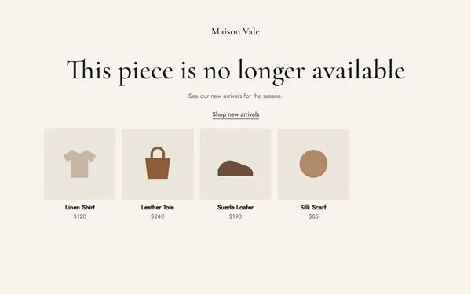](https://mmrahmanbappi.github.io/100-free-404-pages/ecommerce/fashion/) | **Fashion Store** A fashion store page with a large serif headline and four new arrivals.  [Live demo](https://mmrahmanbappi.github.io/100-free-404-pages/ecommerce/fashion/) / [Download from the website](https://mmrahmanbappi.github.io/100-free-404-pages/ecommerce/) |
| [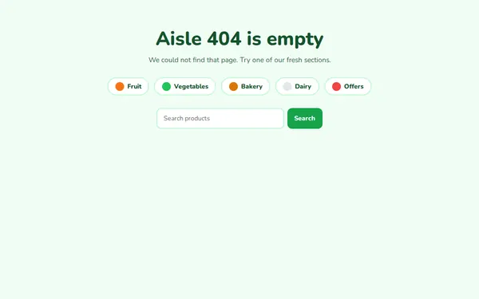](https://mmrahmanbappi.github.io/100-free-404-pages/ecommerce/grocery/) | **Grocery** A grocery store page: 'this aisle is empty', with fruit and veg shortcuts.  [Live demo](https://mmrahmanbappi.github.io/100-free-404-pages/ecommerce/grocery/) / [Download from the website](https://mmrahmanbappi.github.io/100-free-404-pages/ecommerce/) |
| [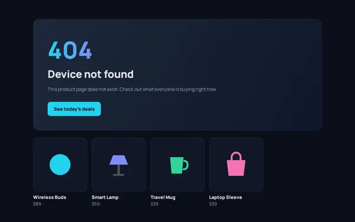](https://mmrahmanbappi.github.io/100-free-404-pages/ecommerce/electronics/) | **Electronics** A tech store page with a dark hero and a row of popular gadgets.  [Live demo](https://mmrahmanbappi.github.io/100-free-404-pages/ecommerce/electronics/) / [Download from the website](https://mmrahmanbappi.github.io/100-free-404-pages/ecommerce/) |
| [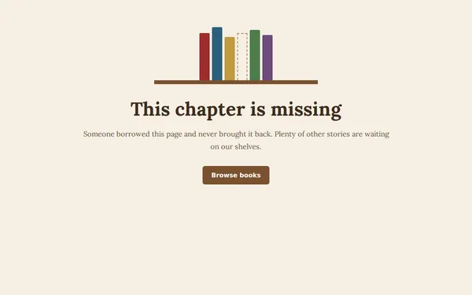](https://mmrahmanbappi.github.io/100-free-404-pages/ecommerce/bookstore/) | **Bookstore** A cozy bookshop page: this chapter is missing, with a shelf of book spines.  [Live demo](https://mmrahmanbappi.github.io/100-free-404-pages/ecommerce/bookstore/) / [Download from the website](https://mmrahmanbappi.github.io/100-free-404-pages/ecommerce/) |
| [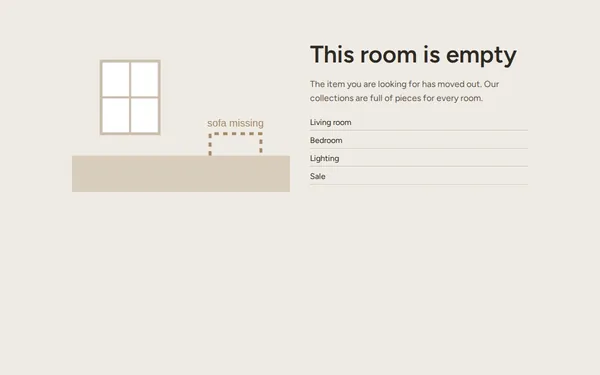](https://mmrahmanbappi.github.io/100-free-404-pages/ecommerce/furniture/) | **Furniture** A calm home store page with an empty room and a 'find it in our collections' link.  [Live demo](https://mmrahmanbappi.github.io/100-free-404-pages/ecommerce/furniture/) / [Download from the website](https://mmrahmanbappi.github.io/100-free-404-pages/ecommerce/) |
| [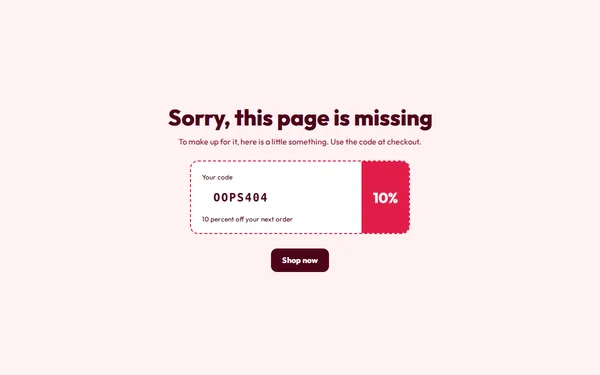](https://mmrahmanbappi.github.io/100-free-404-pages/ecommerce/coupon/) | **Coupon** A tear-off coupon that gives visitors a small discount to make up for the missing page.  [Live demo](https://mmrahmanbappi.github.io/100-free-404-pages/ecommerce/coupon/) / [Download from the website](https://mmrahmanbappi.github.io/100-free-404-pages/ecommerce/) |
| [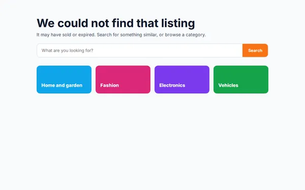](https://mmrahmanbappi.github.io/100-free-404-pages/ecommerce/marketplace/) | **Marketplace** A marketplace page with a search bar and popular categories as big tiles.  [Live demo](https://mmrahmanbappi.github.io/100-free-404-pages/ecommerce/marketplace/) / [Download from the website](https://mmrahmanbappi.github.io/100-free-404-pages/ecommerce/) |
| [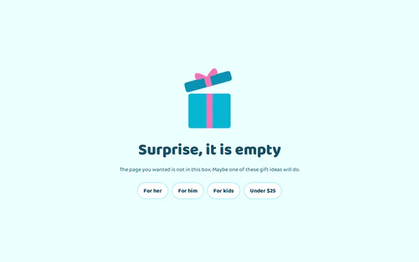](https://mmrahmanbappi.github.io/100-free-404-pages/ecommerce/gift-box/) | **Gift Shop** A wrapped gift box that opens to show the page is not inside, with gift ideas.  [Live demo](https://mmrahmanbappi.github.io/100-free-404-pages/ecommerce/gift-box/) / [Download from the website](https://mmrahmanbappi.github.io/100-free-404-pages/ecommerce/) |

### Scenes and Seasons (10)

Full scenes, from rainy streets to snowy mountains. [See all scenes and seasons templates](https://mmrahmanbappi.github.io/100-free-404-pages/seasonal/)

| Preview | Template |
|---|---|
| [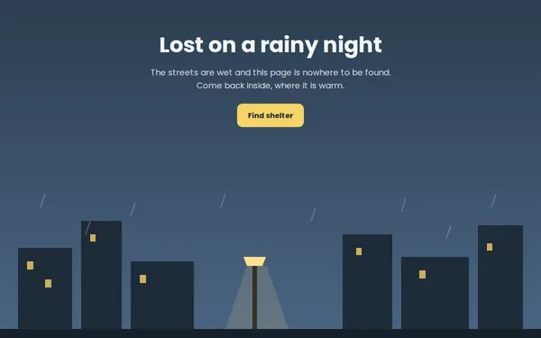](https://mmrahmanbappi.github.io/100-free-404-pages/seasonal/rainy-city/) | **Rainy City** A city skyline at night in the rain, with one street lamp glowing.  [Live demo](https://mmrahmanbappi.github.io/100-free-404-pages/seasonal/rainy-city/) / [Download from the website](https://mmrahmanbappi.github.io/100-free-404-pages/seasonal/) |
| [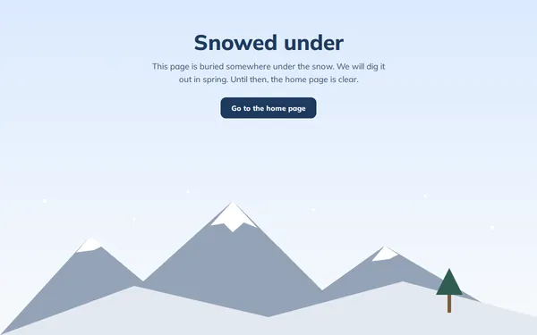](https://mmrahmanbappi.github.io/100-free-404-pages/seasonal/snowy-mountains/) | **Snowy Mountains** Snow-capped mountains and snowflakes on a pale winter sky.  [Live demo](https://mmrahmanbappi.github.io/100-free-404-pages/seasonal/snowy-mountains/) / [Download from the website](https://mmrahmanbappi.github.io/100-free-404-pages/seasonal/) |
| [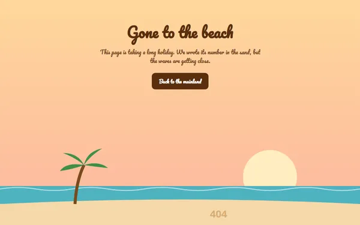](https://mmrahmanbappi.github.io/100-free-404-pages/seasonal/beach/) | **Beach** A sunset beach with a palm tree and '404' written in the sand.  [Live demo](https://mmrahmanbappi.github.io/100-free-404-pages/seasonal/beach/) / [Download from the website](https://mmrahmanbappi.github.io/100-free-404-pages/seasonal/) |
| [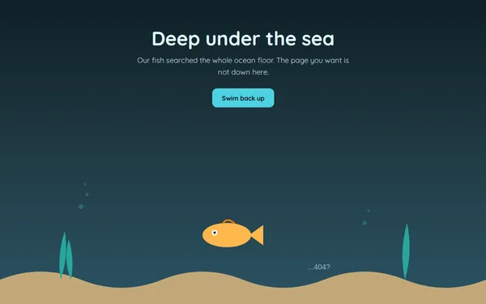](https://mmrahmanbappi.github.io/100-free-404-pages/seasonal/under-the-sea/) | **Under the Sea** An underwater scene with seaweed, bubbles and a puzzled orange fish.  [Live demo](https://mmrahmanbappi.github.io/100-free-404-pages/seasonal/under-the-sea/) / [Download from the website](https://mmrahmanbappi.github.io/100-free-404-pages/seasonal/) |
| [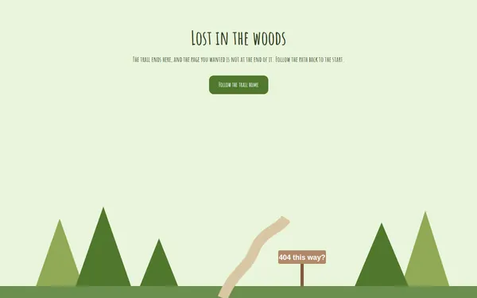](https://mmrahmanbappi.github.io/100-free-404-pages/seasonal/forest-trail/) | **Forest Trail** A forest with a winding path and a confused wooden signpost.  [Live demo](https://mmrahmanbappi.github.io/100-free-404-pages/seasonal/forest-trail/) / [Download from the website](https://mmrahmanbappi.github.io/100-free-404-pages/seasonal/) |
| [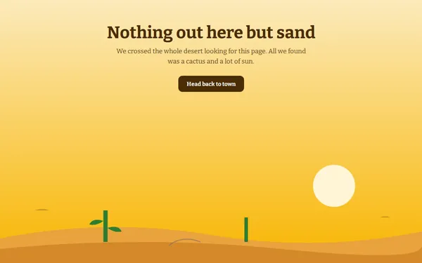](https://mmrahmanbappi.github.io/100-free-404-pages/seasonal/desert/) | **Desert** Golden sand dunes, a big sun and a lonely cactus.  [Live demo](https://mmrahmanbappi.github.io/100-free-404-pages/seasonal/desert/) / [Download from the website](https://mmrahmanbappi.github.io/100-free-404-pages/seasonal/) |
| [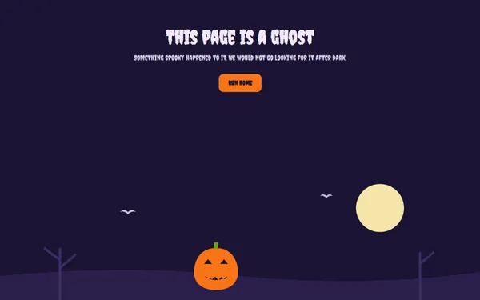](https://mmrahmanbappi.github.io/100-free-404-pages/seasonal/halloween/) | **Halloween** A spooky night with a grinning pumpkin, bare trees and bats. Great for October.  [Live demo](https://mmrahmanbappi.github.io/100-free-404-pages/seasonal/halloween/) / [Download from the website](https://mmrahmanbappi.github.io/100-free-404-pages/seasonal/) |
| [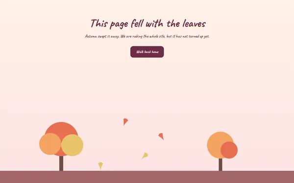](https://mmrahmanbappi.github.io/100-free-404-pages/seasonal/autumn-leaves/) | **Autumn Leaves** Warm autumn trees in orange and gold, with loose leaves in the air.  [Live demo](https://mmrahmanbappi.github.io/100-free-404-pages/seasonal/autumn-leaves/) / [Download from the website](https://mmrahmanbappi.github.io/100-free-404-pages/seasonal/) |
| [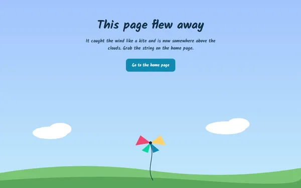](https://mmrahmanbappi.github.io/100-free-404-pages/seasonal/kite-meadow/) | **Kite Meadow** A bright spring meadow with a colorful kite flying off with the page.  [Live demo](https://mmrahmanbappi.github.io/100-free-404-pages/seasonal/kite-meadow/) / [Download from the website](https://mmrahmanbappi.github.io/100-free-404-pages/seasonal/) |
| [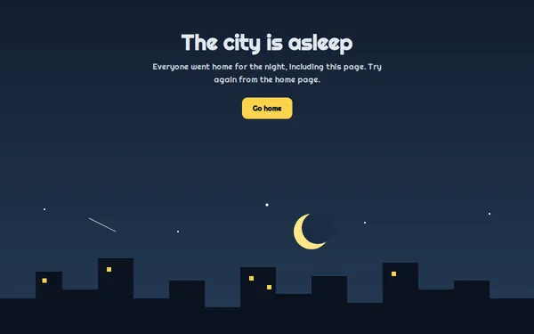](https://mmrahmanbappi.github.io/100-free-404-pages/seasonal/city-night/) | **City at Night** A quiet city skyline at night with a crescent moon and lit windows.  [Live demo](https://mmrahmanbappi.github.io/100-free-404-pages/seasonal/city-night/) / [Download from the website](https://mmrahmanbappi.github.io/100-free-404-pages/seasonal/) |

## Questions or ideas

[Open an issue](https://github.com/mmrahmanbappi/100-free-404-pages/issues) if something does not work, or if you have an idea for a new template. See [CONTRIBUTING.md](CONTRIBUTING.md) to add one yourself.

## License

[MIT](LICENSE). Free for personal and business use.

Made by [MM Rahman Bappi](https://mmseo.app/).
